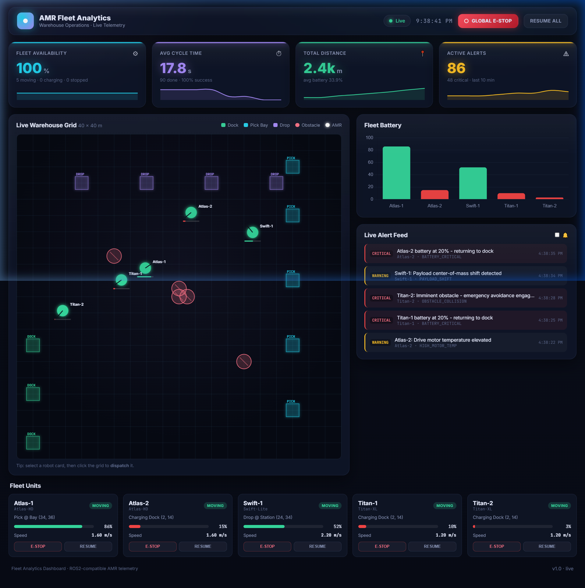
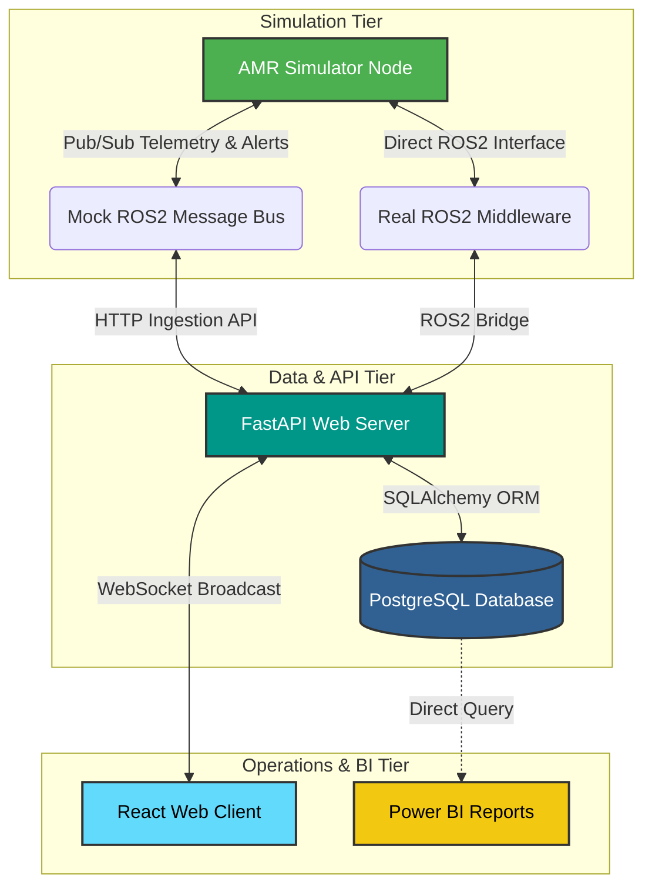

# 📖 AMR Fleet Analytics Platform Wiki

Welcome to the technical developer documentation wiki for the **Autonomous Mobile Robot (AMR) Fleet Analytics Platform**. This workspace serves as a deep dive into the engineering, architecture, protocols, and data schemas that power the fleet dashboard, simulators, database layer, and BI reporting tools.

---

## 🧭 Wiki Table of Contents

Navigate through the technical specifications using the links below:

| Documentation Page | Description | Key Topics Covered |
| :--- | :--- | :--- |
| 🏗 **[System Architecture](wiki/Architecture.md)** | Core system-wide layout, dockerized orchestration, and networking. | Message queues, Docker ports, ROS2 bridges, fallback mock bus. |
| 🎨 **[React Frontend Specification](wiki/Frontend.md)** | In-depth breakdown of the client-side SPA and state machinery. | HTML5 Canvas rendering, WebSockets state sync, E-Stop logic, dynamic map coords. |
| 🔌 **[FastAPI Backend Specs](wiki/Backend.md)** | REST endpoints, WebSocket routes, database schema, and transaction flows. | FastAPI routers, PostgreSQL schemas, SQLAlchemy model configs, WS connection loops. |
| 🤖 **[AMR Simulator Logic](wiki/Simulator.md)** | Physics engine, batteries, navigation routines, and path planning. | A* navigation mock, discharge profiles, auto-docking, random faults. |
| 📊 **[Power BI Integration Guide](wiki/PowerBI.md)** | Analytical modeling, DAX measurements, and dashboard designs. | PostgreSQL connections, DirectQuery refreshes, metrics calculation, CSV seeds. |

---

## 🏗 High-Level System Architecture

The AMR Fleet Analytics Platform is engineered to process telemetry streams and route operational control commands across multiple sandboxed components:

---

## 🛠 Target Personas & Use Cases

- **Control Room Operators:** Utilize the [React Frontend Dashboard](wiki/Frontend.md) to inspect live AMR locations, monitor active diagnostic alerts, trigger E-Stops, and manually dispatch units to targets.
- **Data Analysts:** Utilize the [Power BI Integration Guide](wiki/PowerBI.md) to track historical operational efficiency, calculate battery cell lifecycles, and evaluate delivery bottlenecks.
- **Robotics Engineers:** Reference the [AMR Simulator Logic](wiki/Simulator.md) and [System Architecture](wiki/Architecture.md) to run tests against real ROS2 nodes or prototype new coordinate pathfinders.
- **Backend Developers:** Reference the [FastAPI Backend Specs](wiki/Backend.md) to expand REST route structures, add new telemetry fields, or scale WebSocket handling.
