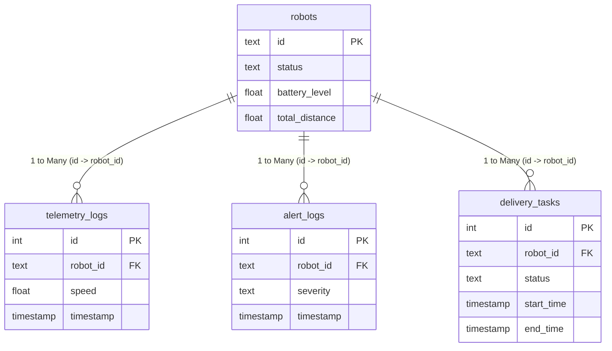

# 📊 Power BI Analytics Integration Guide

[](https://powerbi.microsoft.com/)
[](https://www.postgresql.org/)
[](https://learn.microsoft.com/en-us/dax/)

This guide provides step-by-step instructions on connecting **Power BI Desktop** to the PostgreSQL database powering the AMR Fleet Analytics Dashboard, and building operational reports.

For a detailed analysis of the underlying data model, relationships, and advanced report cards, please see the **[Power BI Wiki Page](../wiki/PowerBI.md)**.

---

## 🔌 1. Data Connection Options

### Option A: Live PostgreSQL Database (Recommended)
By default, the dockerized PostgreSQL container exposes port **`5432`** to your host machine.

#### Database Connection Settings
| Parameter | Value |
| :--- | :--- |
| **Server** | `localhost` |
| **Port** | `5432` |
| **Database** | `fleet` |
| **Authentication** | Database (User: `fleet` / Pass: `fleet`) |

#### Connection Steps
1. Verify that your dockerized fleet stack is currently active:
   ```bash
   docker-compose up -d
   ```
2. Open **Power BI Desktop**, navigate to **Home** $\rightarrow$ **Get Data** $\rightarrow$ **PostgreSQL database**.
3. Input `localhost` for the server, and `fleet` for the database.
4. Choose **DirectQuery** for near real-time telemetry rendering (updates tiles immediately as robots move), or **Import** to take data snapshots.
5. In the Navigator pane, select the following target tables:
   - `robots` (dim table)
   - `telemetry_logs` (fact table)
   - `alert_logs` (fact table)
   - `delivery_tasks` (fact table)
6. Click **Load**.

> [!WARNING]
> **Connector Dependency:** Power BI's PostgreSQL connection requires the *Npgsql* ADO.NET provider. If you see a driver warning, download and install the latest Npgsql release from [npgsql.org](https://www.npgsql.org/) and restart Power BI.

---

### Option B: Local CSV Prototyping (Offline)
If you are running Power BI on a system without access to the Docker daemon, you can prototype your reports using the pre-configured sample datasets located in this directory:
* `sample_robots.csv`
* `sample_telemetry_logs.csv`
* `sample_alert_logs.csv`
* `sample_delivery_tasks.csv`

#### Importing CSVs
In Power BI Desktop, click **Get Data** $\rightarrow$ **Text/CSV**, import each file, and proceed to set up the relationships detailed below.

---

## 📐 2. Data Model & Relationships

Open the **Model View** in Power BI and link your tables. Establish one-to-many ($1 \rightarrow *$) relationships from the primary key `robots[id]` to foreign keys in the fact logs.



> [!IMPORTANT]
> Ensure that `timestamp`, `start_time`, and `end_time` columns are marked as **Date/Time** types. We recommend adding a standard **Date Table** to your model for time-intelligence filtering.

---

## 📈 3. Suggested DAX Measures

Add these calculations to your reports to extract operational insights:

### Fleet Availability %
*Measures the percentage of the fleet that is not in a faulted (`error`) or manually locked (`estopped`) state.*
```dax
Fleet Availability % = 
VAR Total = DISTINCTCOUNT( robots[id] )
VAR Down  = CALCULATE( DISTINCTCOUNT( robots[id] ), 
                       robots[status] IN { "estopped", "error" } )
RETURN DIVIDE( Total - Down, Total ) * 100
```

### Average Cycle Time (s)
*Calculates the mean time taken (in seconds) for AMRs to complete a delivery task.*
```dax
Avg Cycle Time (s) = 
AVERAGEX(
    FILTER( delivery_tasks, delivery_tasks[status] = "completed" ),
    DATEDIFF( delivery_tasks[start_time], delivery_tasks[end_time], SECOND )
)
```

### Task Success Rate %
*Calculates task completions against failures.*
```dax
Task Success Rate % = 
DIVIDE(
    CALCULATE( COUNTROWS( delivery_tasks ), delivery_tasks[status] = "completed" ),
    CALCULATE( COUNTROWS( delivery_tasks ), 
               delivery_tasks[status] IN { "completed", "failed", "aborted" } )
) * 100
```

### Total Distance (km)
*Aggregates distance covered by all AMRs.*
```dax
Total Distance (km) = SUM( robots[total_distance] ) / 1000
```

### Critical Alerts (24h)
*Flags critical hardware/sensor faults raised during the last 24 hours.*
```dax
Critical Alerts (24h) = 
CALCULATE(
    COUNTROWS( alert_logs ),
    alert_logs[severity] = "critical",
    alert_logs[timestamp] >= NOW() - 1
)
```

---

## 🎛 4. Operational Report Layouts

We recommend structuring your Power BI report into three dashboard views:

```text
├── Page 1: Operational Efficiency (Real-Time Floor KPIs)
│   ├── KPI Cards: Availability %, Avg Cycle Time, Success Rate, Distance (km)
│   ├── Line Chart: Completed tasks per hour (x-axis: end_time)
│   ├── Bar Chart: Task distribution count grouped by robot
│   └── Gauge: Average charge percentage (value: robots[battery_level])
│
├── Page 2: Safety & Alert Auditing (Risk & Diagnostics)
│   ├── Stacked Columns: Monthly alert volume by severity (critical, warning, info)
│   ├── Audit Grid: Live details of active criticals (timestamp, msg, AMR ID)
│   ├── Donut Chart: Alert codes distribution (LIDAR_FAILURE, OBSTACLE_COLLISION)
│   └── KPI Card: Critical Alerts (24h)
│
└── Page 3: Fleet Maintenance Planner (Wear & Lifecycles)
    ├── Matrix View: Robot ID × Avg Speed × Cumulative Distance (Wear tracker)
    ├── Scatter Plot: Distance vs. Alert counts (highlights fault-prone units)
    ├── Bar Chart: Current battery levels (using conditional formatting: red if <20%)
    └── Floor Map: Last known coordinates (latitude/longitude mapped from telemetry)
```

---

## 🔄 5. Data Refresh Cadence

- **DirectQuery Mode:** Go to the report canvas $\rightarrow$ **Format Page** $\rightarrow$ **Page refresh**, enable it, and set the interval (e.g., every 5 seconds) to maintain a live operations wall dashboard.
- **Import Mode:** Configure scheduled refreshes via the **Power BI Service** by installing an On-Premises Data Gateway and targeting the host database.

---

## 🧪 6. Exporting Fresh Sample CSVs

To overwrite the static CSVs in this folder with current database state:

```bash
# Export Telemetry
docker exec -t fleet-db psql -U fleet -d fleet \
  -c "\copy (SELECT * FROM telemetry_logs) TO STDOUT WITH CSV HEADER" > sample_telemetry_logs.csv

# Export Robots
docker exec -t fleet-db psql -U fleet -d fleet \
  -c "\copy (SELECT * FROM robots) TO STDOUT WITH CSV HEADER" > sample_robots.csv

# Export Alerts
docker exec -t fleet-db psql -U fleet -d fleet \
  -c "\copy (SELECT * FROM alert_logs) TO STDOUT WITH CSV HEADER" > sample_alert_logs.csv

# Export Tasks
docker exec -t fleet-db psql -U fleet -d fleet \
  -c "\copy (SELECT * FROM delivery_tasks) TO STDOUT WITH CSV HEADER" > sample_delivery_tasks.csv
```

