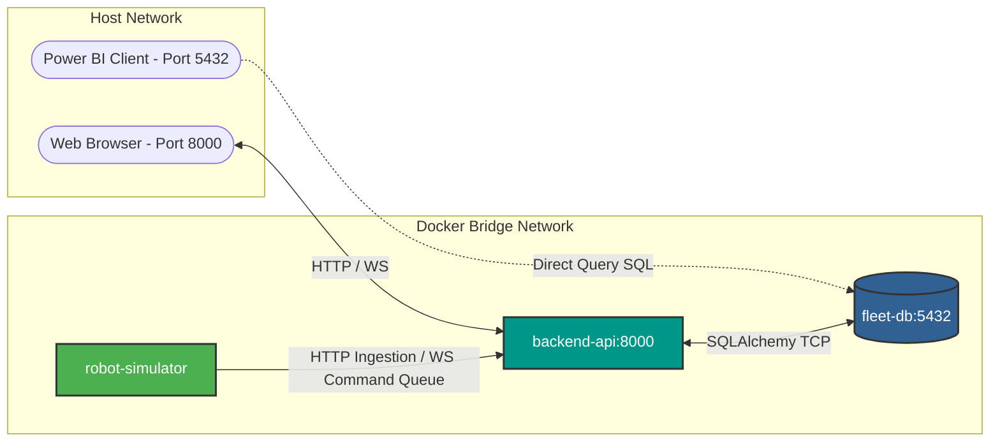
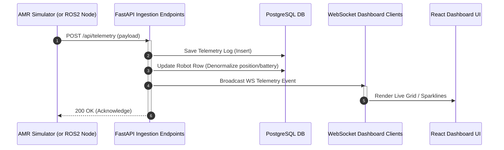
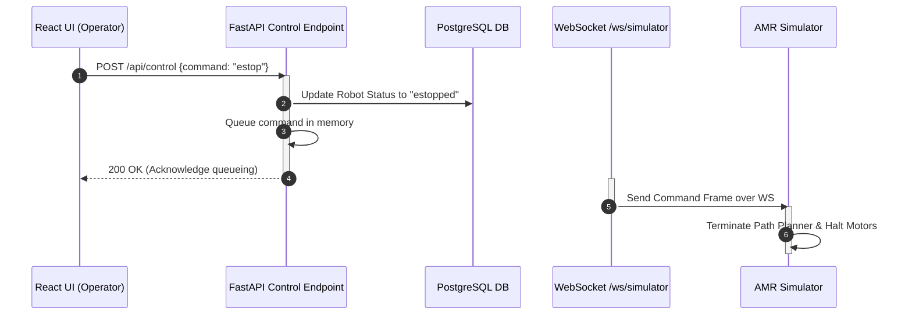

# 🏗 System Architecture & Data Flows

This page details the overall architecture, deployment patterns, and data communications utilized across the AMR Fleet Analytics Dashboard platform.

---

## 📡 1. Dockerized Microservices Topology

The application runs as three containerized services managed by `docker-compose.yml`. Network isolation and host port mappings are structured as follows:



### Port Mapping & Purpose
| Container Name | Internal Port | Host Port | Protocol | Purpose |
| :--- | :--- | :--- | :--- | :--- |
| **`fleet-db`** | `5432` | `5432` | TCP | PostgreSQL service storage. |
| **`fleet-backend`**| `8000` | `8000` | TCP (HTTP/WS) | Hosts FastAPI backend, REST API, WebSocket loops, and serves built React static files. |
| **`fleet-simulator`**| *N/A (Internal)* | *N/A* | HTTP/WS client | Python process simulating AMRs and publishing telemetry. |

---

## 🔄 2. Communication Sequence Diagrams

Telemetry flows asynchronously from the robots up to the backend for storage and client-side broadcasting. Control commands propagate downwards from the operator interface.

### A. Telemetry & Alert Ingestion Flow
1. The simulated AMR (or ROS2 node) publishes status metrics.
2. The HTTP Client within the simulator executes a `POST` request to the backend.
3. The backend persists the time-series entry to PostgreSQL.
4. The backend broadcasts the payload instantly to all active WebSocket connections on `/ws/dashboard`.



---

### B. Control Commands Flow (Dispatch & E-Stop)
1. The operator clicks **GLOBAL E-STOP** or triggers a manual **Dispatch** coordinate point.
2. The React frontend sends an HTTP `POST` to `/api/control`.
3. The backend updates the denormalized database state.
4. The backend adds the command to the `ConnectionManager` queue and broadcasts it.
5. The Simulator, connected via `/ws/simulator`, consumes the queue frame and updates AMR routing state.



---

## 🔌 3. ROS2 Interoperability Layer

The system design bridges physical robotics with typical web-application architectures using a dual-mode communication layer.

```text
+--------------------------------------------------------------------------+
|                          robot_simulator.py                              |
|                                                                          |
|       Detects ROS2 (rclpy) runtime at startup:                           |
|                                                                          |
|       [ROS2 Found]                                   [ROS2 Not Found]    |
|             │                                               │            |
|             ▼                                               ▼            |
|       Native ROS2 Pub/Sub                            mock_rclpy.py       |
|  - Publishes: /amr/telemetry                   - Mimics standard rclpy   |
|  - Publishes: /amr/alerts                        Node, Pub, Sub interfaces|
|  - Subscribes: /amr/commands                   - Forwards packets via    |
|                                                  in-process mock bus     |
+--------------------------------------------------------------------------+
```

### Native ROS2 Mode
When the simulator runs in an environment where ROS2 (e.g. Humble/Iron) is configured:
- `import rclpy` succeeds.
- Communication with the backend is bridged via standard ROS2 topics.
- Topics match standard industrial sensor types (`geometry_msgs/msg/Pose2D`, `sensor_msgs/msg/BatteryState`).

### Mock Fallback Mode
When running inside the default Docker containers or on a machine without ROS2 installed:
- The simulator imports `mock_rclpy.py` (which mirrors the syntax of `rclpy`).
- Telemetry, tasks, and commands are sent using background threads and HTTP requests, bypassing the ROS2 DDS middleware entirely.
- This allows web developers to modify frontend components, DB schemas, or API layouts without having to compile ROS2 workspaces locally.
