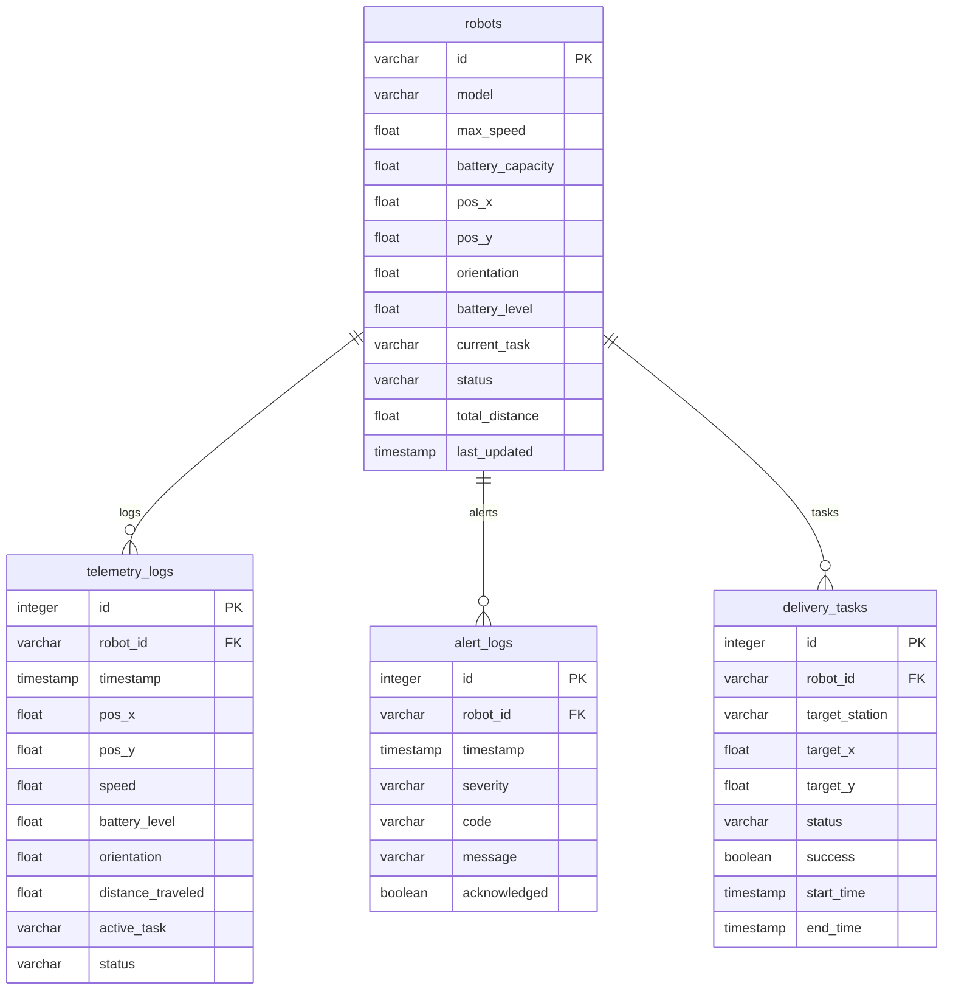

# 🔌 FastAPI Backend & Database Specs

This page outlines the server-side architecture, covering REST routes, WebSocket communication structures, and PostgreSQL relational schemas.

---

## 💾 1. Database Model & Time-Series Schemas

The platform utilizes a PostgreSQL instance. The tables are configured using the **SQLAlchemy ORM** to store both denormalized state parameters (for rapid snapshot loading) and time-series historical records.

### Table Definitions

#### A. `robots` (Dimension Table)
*Contains the current, real-time status of each registered AMR.*
- `id` (VARCHAR, Primary Key): Unique identifier (e.g. `AMR_001`).
- `model` (VARCHAR): Model category (e.g. `Heavy_Lifter`, `Light_Courier`).
- `max_speed` (FLOAT): Velocity ceiling (m/s).
- `battery_capacity` (FLOAT): Rated capacity (Wh).
- `pos_x` / `pos_y` (FLOAT): Latest 2D grid position coordinates.
- `orientation` (FLOAT): Current heading in radians ($-\pi$ to $\pi$).
- `battery_level` (FLOAT): Current charge percentage ($0\% - 100\%$).
- `status` (VARCHAR): Current status (`idle`, `moving`, `charging`, `estopped`, `error`).
- `total_distance` (FLOAT): Cumulative travel odometer in meters.

#### B. `telemetry_logs` (Fact Table - Time Series)
*Appends high-frequency telemetry history. Used for sparklines and analytical reports.*
- `id` (INTEGER, Primary Key, Auto-increment).
- `robot_id` (VARCHAR, Foreign Key referencing `robots.id`).
- `timestamp` (TIMESTAMP, default `UTC NOW`).
- `pos_x` / `pos_y` (FLOAT): Robot coordinates.
- `speed` (FLOAT): Current instantaneous speed (m/s).
- `battery_level` (FLOAT): Battery percentage.
- `orientation` (FLOAT): Vector heading.
- `distance_traveled` (FLOAT): Current robot odometer state.
- `active_task` (VARCHAR): Task description if active.
- `status` (VARCHAR): AMR state flag.

#### C. `alert_logs` (Fact Table - Events)
*Stores diagnostic and collision alerts.*
- `id` (INTEGER, Primary Key).
- `robot_id` (VARCHAR, Foreign Key).
- `timestamp` (TIMESTAMP).
- `severity` (VARCHAR): Alert tier (`info`, `warning`, `critical`).
- `code` (VARCHAR): Machine code (e.g., `LIDAR_OBSTACLE`, `BATTERY_LOW`).
- `message` (VARCHAR): Detailed human-readable log.
- `acknowledged` (BOOLEAN): Control room acknowledgment flag.

#### D. `delivery_tasks` (Fact Table - Operations)
*Tracks delivery logs and task success rates.*
- `id` (INTEGER, Primary Key).
- `robot_id` (VARCHAR, Foreign Key).
- `target_station` (VARCHAR): Name of target dock/bay (e.g. `Pick Bay B`).
- `target_x` / `target_y` (FLOAT): Destination target.
- `status` (VARCHAR): Task state (`in_progress`, `completed`, `failed`, `aborted`).
- `success` (BOOLEAN): Completion flag.
- `start_time` / `end_time` (TIMESTAMP): Cycle timers.

---

## 📡 2. REST API Endpoint Mapping

The FastAPI server exposes endpoints categorized by functional layer:

### A. Ingestion Layer (Called by Simulators)
- **`POST /api/robots/register`**
  - Schema: `RobotRegister`
  - Purpose: Adds new AMRs to the `robots` table or refreshes hardware stats.
- **`POST /api/telemetry`**
  - Schema: `TelemetryIn`
  - Purpose: Records telemetry logs in SQL and pushes real-time frames to the WebSocket broadcast.
- **`POST /api/alerts`**
  - Schema: `AlertIn`
  - Purpose: Records alarms and triggers flashing visual notifications.
- **`POST /api/tasks`**
  - Schema: `TaskIn`
  - Purpose: Logs a newly assigned transport mission.
- **`PUT /api/tasks`**
  - Schema: `TaskUpdate`
  - Purpose: Marks active missions as complete/aborted and records end times.

### B. Control Layer (Called by Frontend Operator)
- **`POST /api/control`**
  - Schema: `CommandIn`
  - Payload Options:
    - `{command: "estop", robot_id: "AMR_001"}` (Stops individual unit)
    - `{command: "estop_all"}` (Hhalts all fleet units)
    - `{command: "resume_all"}` (Restores operational states)
    - `{command: "dispatch", robot_id: "AMR_001", target_x: 12.0, target_y: 25.0}` (Dispatches robot)
  - Purpose: Updates target status fields and pushes commands into the simulator's WebSocket queue.

### C. Query Layer (Called by Frontend / BI Tools)
- **`GET /api/fleet/status`** $\rightarrow$ Returns active snapshots of all AMRs and aggregated KPIs.
- **`GET /api/fleet/metrics`** $\rightarrow$ Returns lightweight KPI numbers (used for rapid UI polling).
- **`GET /api/robots`** $\rightarrow$ Lists metadata for all registered units.
- **`GET /api/alerts?limit=50`** $\rightarrow$ Fetches recent alerts, sorted by latest.
- **`POST /api/alerts/{id}/ack`** $\rightarrow$ Acknowledges a specific alert.
- **`GET /api/tasks?limit=50`** $\rightarrow$ Fetches transport logs.
- **`GET /api/telemetry/{robot_id}?limit=100`** $\rightarrow$ Historical logs for telemetry charts.

---

## 🔄 3. WebSocket Routing & Fans (`ConnectionManager`)

High-frequency telemetry requires zero-latency routing. FastAPI handles this via memory-bound channels:

### Browser Dashboard Connection (`/ws/dashboard`)
- Dashboard clients connect to this route.
- On connection, the server queries the database and immediately pushes a full `snapshot` JSON frame (containing the latest robot states and fleet metrics).
- On subsequent ticks, the server streams lightweight `telemetry` or `alert` updates.

### Simulator Client Connection (`/ws/simulator`)
- Running simulators connect to this channel to listen for control instructions.
- The backend hosts an asynchronous queue (`asyncio.Queue`) for commands.
- When an operator submits a command (e.g. E-Stop or Dispatch), the control endpoint adds it to the queue.
- The simulator WS listener pops command messages from the queue and sends them to the simulator.
