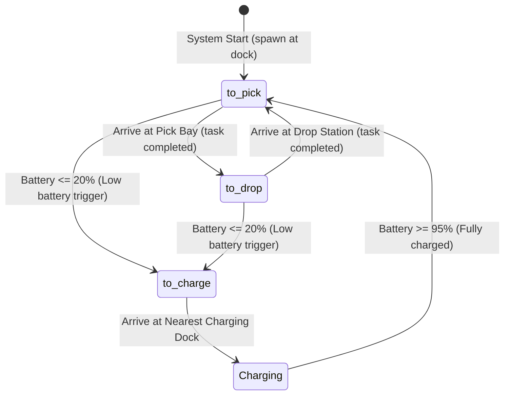

# 🤖 AMR Simulator & Physics Logic

This page provides the mathematical models and logic structures driving the Autonomous Mobile Robot (AMR) fleet simulator.

---

## 🛠 1. Physical Robot Configurations

The simulator instantiates a heterogeneous fleet of five AMRs. Each unit is modeled with unique characteristics that dictate its velocity, capacity, battery drain rates, and diagnostic failure likelihood.

| Robot ID | Model | Max Speed | Battery Capacity | Discharge Rate | Base Fault Rate |
| :--- | :--- | :---: | :---: | :---: | :---: |
| **`Atlas-1`** | `Atlas-HD` | $1.6\text{ m/s}$ | $1200\text{ Wh}$ | $0.45\% \text{ per tick}$ | $1.0\% \text{ probability/tick}$ |
| **`Atlas-2`** | `Atlas-HD` | $1.6\text{ m/s}$ | $1200\text{ Wh}$ | $0.50\% \text{ per tick}$ | $1.2\% \text{ probability/tick}$ |
| **`Titan-1`** | `Titan-XL` | $1.2\text{ m/s}$ | $2000\text{ Wh}$ | $0.35\% \text{ per tick}$ | $0.8\% \text{ probability/tick}$ |
| **`Titan-2`** | `Titan-XL` | $1.2\text{ m/s}$ | $2000\text{ Wh}$ | $0.40\% \text{ per tick}$ | $1.4\% \text{ probability/tick}$ |
| **`Swift-1`** | `Swift-Lite` | $2.2\text{ m/s}$ | $800\text{ Wh}$ | $0.65\% \text{ per tick}$ | $1.6\% \text{ probability/tick}$ |

---

## 🧭 2. Warehouse Landmarks & Obstacles

The coordinate system maps a $40\text{m} \times 40\text{m}$ Euclidean plane. Landmark elements are defined at static coordinate intersections:

- 🔋 **Charging Docks:** `(2, 2)`, `(2, 8)`, `(2, 14)`
- 📥 **Picking Bays:** `(34, 6)`, `(34, 14)`, `(34, 22)`, `(34, 30)`, `(34, 36)`
- 📤 **Drop-off Stations:** `(8, 34)`, `(16, 34)`, `(24, 34)`, `(32, 34)`
- 🛑 **Obstacle Zones:** `(20, 20)`, `(21, 20)`, `(20, 21)`, `(12, 25)`, `(28, 12)`

---

## 🔄 3. AMR State & Path Routing Machine

Each AMR cycles through three main routing states depending on task progress and battery percentages:

### Routing Phases:
1. **`to_pick`**: Selects a random target picking bay from `PICKING_BAYS`.
2. **`to_drop`**: Navigates from picking bay to a randomly selected drop-off station from `DROPOFF_STATIONS`.
3. **`to_charge`**: Low battery override. Terminates the active task, logs a `failed` task state, selects the closest `CHARGING_DOCKS` coordinates using Euclidean distance, and proceeds there.

---

## 🧮 4. Physics Engine Calculations

On each simulation tick (defined by `TICK` variable, default $0.5\text{s}$):

### Target Heading
Orientation heading $\theta$ (in radians) is calculated relative to destination targets:
$$\theta = \operatorname{atan2}(t_y - y, t_x - x)$$

### Velocity & Obstacle Caution
The step displacement distance is capped by the maximum speed of the robot:
$$\text{step} = \min(\text{speed}_{\max} \cdot \Delta t, d)$$
Where $d$ is Euclidean distance to the target:
$$d = \sqrt{(t_x - x)^2 + (t_y - y)^2}$$

If the robot enters an **Obstacle Caution Buffer Zone** (any coordinate point within a $2.5\text{m}$ radius of any coordinate in `OBSTACLE_ZONES`):
- The speed step length is scaled down by a factor of **`0.4`** to simulate slow caution.
- There is a $5\%$ probability per tick that a `critical` event (`OBSTACLE_COLLISION`) is logged to test alert systems.

### Battery Cells Model
- **Discharging:** While moving, the battery level is decremented:
  $$\text{battery} = \max(0, \text{battery} - \text{discharge\_rate})$$
- **Charging:** While stationed at a dock:
  $$\text{battery} = \min(100, \text{battery} + 2.5\% \text{ per tick})$$

---

## 🚨 5. Diagnostic Alerts Configuration

Warnings and critical errors are automatically triggered based on base error probability rates.

### Warn Messages
Warnings do not halt the AMR, but generate visual yellow markers on the control logs:
- `LIDAR_OBSCURED` — Lidar partially obscured, reduced perception.
- `HIGH_MOTOR_TEMP` — Drive motor temperature elevated.
- `WHEEL_SLIP` — Wheel slippage detected.
- `PAYLOAD_SHIFT` — Payload center-of-mass shift.

### Critical Messages
Critical failures generate red flashing UI indicators and halt or modify path planning:
- `OBSTACLE_COLLISION` — Emergency avoidance active.
- `LIDAR_FAILURE` — Lidar sensor failure.
- `BATTERY_CRITICAL` — Triggers automated abort/return-to-dock routing.
